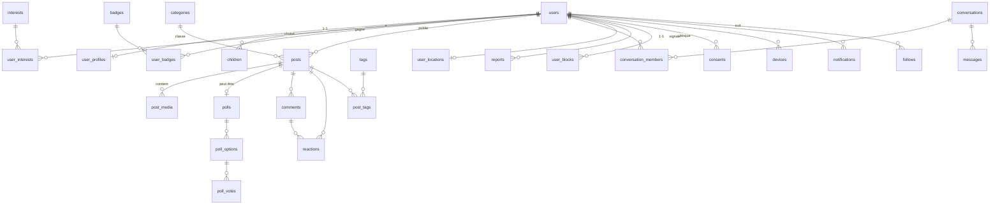

# Mamaya — Étape 2 : Modélisation de la base de données

> PostgreSQL 16 + PostGIS. Conventions : clés primaires `uuid` (v7, triables par temps),
> horodatages `timestamptz`, soft delete via `deleted_at`, colonnes sensibles chiffrées
> en applicatif (suffixe `_enc`, format AES-256-GCM en enveloppe — détail à l'Étape 4).
> Statut : proposition CTO — à valider avant l'Étape 3.

---

## 1. Vue d'ensemble (diagramme entités-relations)



Domaines : **Identité** (users, profils, enfants, consentements) · **Communauté** (posts, sondages, commentaires, réactions, catégories/tags, follows) · **Chat** (conversations, membres, messages) · **Géo** (user_locations) · **Sûreté** (reports, blocks, banned_words, moderation_actions) · **Technique** (devices, notifications, audit_logs).

---

## 2. Identité & profils

```sql
CREATE EXTENSION IF NOT EXISTS postgis;
CREATE EXTENSION IF NOT EXISTS citext;

CREATE TYPE user_status AS ENUM ('enceinte', 'maman', 'essai_bebe');
CREATE TYPE auth_provider AS ENUM ('email', 'google', 'apple');

CREATE TABLE users (
    id                uuid PRIMARY KEY DEFAULT uuidv7(),
    email             citext UNIQUE NOT NULL,
    email_verified_at timestamptz,
    password_hash     text,                      -- Argon2id ; NULL si OAuth uniquement
    provider          auth_provider NOT NULL DEFAULT 'email',
    provider_sub      text,                      -- identifiant OAuth (sub Google/Apple)
    totp_secret_enc   bytea,                     -- 2FA optionnel, chiffré
    totp_enabled      boolean NOT NULL DEFAULT false,
    role              text NOT NULL DEFAULT 'member',  -- member | moderator | admin
    status            user_status NOT NULL,
    due_date          date,                      -- si enceinte (donnée santé → voir Étape 4)
    locale            text NOT NULL DEFAULT 'fr',
    created_at        timestamptz NOT NULL DEFAULT now(),
    deleted_at        timestamptz,               -- soft delete → purge définitive J+30
    UNIQUE (provider, provider_sub)
);

CREATE TABLE user_profiles (
    user_id      uuid PRIMARY KEY REFERENCES users(id) ON DELETE CASCADE,
    display_name text NOT NULL,                  -- pseudo public (jamais le nom légal)
    bio          text,
    avatar_url   text,
    city_label   text,                           -- « Lyon » — libellé choisi, jamais l'adresse
    updated_at   timestamptz NOT NULL DEFAULT now()
);

-- Les enfants : prénom et date de naissance exacte chiffrés.
-- Le mois de naissance en clair suffit pour tout le produit
-- (matching « bébés de mai 2026 », feed par âge) sans exposer la date exacte.
CREATE TABLE children (
    id              uuid PRIMARY KEY DEFAULT uuidv7(),
    user_id         uuid NOT NULL REFERENCES users(id) ON DELETE CASCADE,
    first_name_enc  bytea,                       -- chiffré AES-256-GCM
    birthdate_enc   bytea,                       -- date exacte chiffrée
    birth_month     date NOT NULL,               -- tronquée au 1er du mois (en clair)
    created_at      timestamptz NOT NULL DEFAULT now()
);
CREATE INDEX idx_children_user ON children(user_id);
CREATE INDEX idx_children_birth_month ON children(birth_month);

CREATE TABLE interests (           -- allaitement, sommeil, accouchement, santé…
    id    smallint PRIMARY KEY,
    slug  text UNIQUE NOT NULL,
    label text NOT NULL
);
CREATE TABLE user_interests (
    user_id     uuid REFERENCES users(id) ON DELETE CASCADE,
    interest_id smallint REFERENCES interests(id),
    PRIMARY KEY (user_id, interest_id)
);

CREATE TABLE badges (
    id          smallint PRIMARY KEY,
    slug        text UNIQUE NOT NULL,            -- ex. 'super-maman', 'top-contributrice'
    label       text NOT NULL,
    description text
);
CREATE TABLE user_badges (
    user_id    uuid REFERENCES users(id) ON DELETE CASCADE,
    badge_id   smallint REFERENCES badges(id),
    awarded_at timestamptz NOT NULL DEFAULT now(),
    PRIMARY KEY (user_id, badge_id)
);
```

**RGPD — consentements et cycle de vie :**

```sql
CREATE TABLE consents (
    id         uuid PRIMARY KEY DEFAULT uuidv7(),
    user_id    uuid NOT NULL REFERENCES users(id) ON DELETE CASCADE,
    kind       text NOT NULL,        -- 'cgu', 'geoloc', 'notifications', 'analytics'
    version    text NOT NULL,        -- version du texte accepté
    granted_at timestamptz NOT NULL DEFAULT now(),
    revoked_at timestamptz           -- NULL = consentement actif
);
CREATE INDEX idx_consents_user_kind ON consents(user_id, kind);

CREATE TABLE deletion_requests (    -- suppression « en un clic »
    user_id      uuid PRIMARY KEY REFERENCES users(id),
    requested_at timestamptz NOT NULL DEFAULT now(),
    purge_after  timestamptz NOT NULL,           -- requested_at + 30 jours
    purged_at    timestamptz
);
```

---

## 3. Communauté (feed, posts, sondages, réactions)

```sql
CREATE TYPE post_type AS ENUM ('texte', 'photo', 'sondage');
CREATE TYPE moderation_state AS ENUM ('en_attente', 'approuve', 'rejete', 'revue_humaine');

CREATE TABLE categories (           -- Allaitement, Sommeil, Accouchement, Santé…
    id    smallint PRIMARY KEY,
    slug  text UNIQUE NOT NULL,
    label text NOT NULL
);

CREATE TABLE posts (
    id             uuid PRIMARY KEY DEFAULT uuidv7(),
    author_id      uuid NOT NULL REFERENCES users(id) ON DELETE CASCADE,
    type           post_type NOT NULL DEFAULT 'texte',
    body           text,
    category_id    smallint REFERENCES categories(id),
    -- ciblage du feed : calculés à la publication à partir du profil de l'autrice
    audience_stage text,             -- ex. 'grossesse_t2', 'bebe_0_3m', 'enfant_2a'
    moderation     moderation_state NOT NULL DEFAULT 'en_attente',
    like_count     integer NOT NULL DEFAULT 0,   -- compteurs dénormalisés
    comment_count  integer NOT NULL DEFAULT 0,   -- (maintenus par triggers/jobs)
    share_count    integer NOT NULL DEFAULT 0,
    created_at     timestamptz NOT NULL DEFAULT now(),
    deleted_at     timestamptz
);
-- Index feed : « posts approuvés récents dans mes catégories / mon stade »
CREATE INDEX idx_posts_feed ON posts (created_at DESC)
    WHERE moderation = 'approuve' AND deleted_at IS NULL;
CREATE INDEX idx_posts_category ON posts (category_id, created_at DESC)
    WHERE moderation = 'approuve' AND deleted_at IS NULL;
CREATE INDEX idx_posts_stage ON posts (audience_stage, created_at DESC)
    WHERE moderation = 'approuve' AND deleted_at IS NULL;
CREATE INDEX idx_posts_author ON posts (author_id, created_at DESC);

CREATE TABLE post_media (
    id         uuid PRIMARY KEY DEFAULT uuidv7(),
    post_id    uuid NOT NULL REFERENCES posts(id) ON DELETE CASCADE,
    s3_key     text NOT NULL,       -- objet S3 privé, servi via URL signée/CDN
    width      int, height int,
    position   smallint NOT NULL DEFAULT 0
);

CREATE TABLE polls (
    post_id   uuid PRIMARY KEY REFERENCES posts(id) ON DELETE CASCADE,
    closes_at timestamptz
);
CREATE TABLE poll_options (
    id       uuid PRIMARY KEY DEFAULT uuidv7(),
    post_id  uuid NOT NULL REFERENCES polls(post_id) ON DELETE CASCADE,
    label    text NOT NULL,
    position smallint NOT NULL
);
CREATE TABLE poll_votes (
    option_id uuid REFERENCES poll_options(id) ON DELETE CASCADE,
    user_id   uuid REFERENCES users(id) ON DELETE CASCADE,
    voted_at  timestamptz NOT NULL DEFAULT now(),
    PRIMARY KEY (option_id, user_id)
);

CREATE TABLE comments (
    id         uuid PRIMARY KEY DEFAULT uuidv7(),
    post_id    uuid NOT NULL REFERENCES posts(id) ON DELETE CASCADE,
    author_id  uuid NOT NULL REFERENCES users(id) ON DELETE CASCADE,
    parent_id  uuid REFERENCES comments(id),      -- 1 niveau de réponse
    body       text NOT NULL,
    moderation moderation_state NOT NULL DEFAULT 'en_attente',
    created_at timestamptz NOT NULL DEFAULT now(),
    deleted_at timestamptz
);
CREATE INDEX idx_comments_post ON comments (post_id, created_at);

-- « Soutiens » (likes) — polymorphes post/commentaire
CREATE TYPE reaction_target AS ENUM ('post', 'comment');
CREATE TABLE reactions (
    user_id     uuid REFERENCES users(id) ON DELETE CASCADE,
    target_type reaction_target NOT NULL,
    target_id   uuid NOT NULL,
    kind        text NOT NULL DEFAULT 'soutien',  -- extensible : 'coeur', 'calin'…
    created_at  timestamptz NOT NULL DEFAULT now(),
    PRIMARY KEY (user_id, target_type, target_id)
);
CREATE INDEX idx_reactions_target ON reactions (target_type, target_id);

CREATE TABLE tags (
    id   serial PRIMARY KEY,
    slug text UNIQUE NOT NULL
);
CREATE TABLE post_tags (
    post_id uuid REFERENCES posts(id) ON DELETE CASCADE,
    tag_id  int REFERENCES tags(id),
    PRIMARY KEY (post_id, tag_id)
);

CREATE TABLE follows (
    follower_id uuid REFERENCES users(id) ON DELETE CASCADE,
    followee_id uuid REFERENCES users(id) ON DELETE CASCADE,
    created_at  timestamptz NOT NULL DEFAULT now(),
    PRIMARY KEY (follower_id, followee_id),
    CHECK (follower_id <> followee_id)
);
```

**Stratégie de feed (V1)** : lecture à la demande (*pull*) — une requête paginée par curseur (`created_at DESC`) filtrée sur les catégories suivies + `audience_stage` compatible avec le profil, avec un score simple `récence × engagement` calculé en SQL. Les index partiels ci-dessus la rendent rapide jusqu'à des millions de posts. En V2 : fan-out des posts vers des listes Redis par utilisatrice active (*push*), sans changer le schéma.

---

## 4. Chat (1-to-1 et groupes)

```sql
CREATE TYPE conversation_type AS ENUM ('dm', 'groupe_prive', 'groupe_public');

CREATE TABLE conversations (
    id          uuid PRIMARY KEY DEFAULT uuidv7(),
    type        conversation_type NOT NULL,
    title       text,                    -- « Mamans de Paris », « Bébés de mai 2026 »
    description text,
    avatar_url  text,
    dm_key      text UNIQUE,             -- pour les DM : hash trié des 2 user_ids → unicité
    created_by  uuid REFERENCES users(id),
    created_at  timestamptz NOT NULL DEFAULT now()
);

CREATE TABLE conversation_members (
    conversation_id uuid REFERENCES conversations(id) ON DELETE CASCADE,
    user_id         uuid REFERENCES users(id) ON DELETE CASCADE,
    role            text NOT NULL DEFAULT 'member',   -- member | admin
    joined_at       timestamptz NOT NULL DEFAULT now(),
    last_read_at    timestamptz,          -- accusés de lecture / badge non-lus
    muted           boolean NOT NULL DEFAULT false,
    PRIMARY KEY (conversation_id, user_id)
);
CREATE INDEX idx_members_user ON conversation_members(user_id);

-- Contenu chiffré au repos (enveloppe AES-256-GCM). Partitionnée par mois :
-- c'est la table qui grossit le plus vite ; purge/archivage par partition.
CREATE TABLE messages (
    id              uuid NOT NULL DEFAULT uuidv7(),
    conversation_id uuid NOT NULL REFERENCES conversations(id) ON DELETE CASCADE,
    sender_id       uuid NOT NULL REFERENCES users(id) ON DELETE CASCADE,
    body_enc        bytea NOT NULL,      -- texte chiffré
    key_id          text NOT NULL,       -- référence de la clé de données (KMS)
    media_s3_key    text,                -- pièce jointe éventuelle (bucket chiffré)
    created_at      timestamptz NOT NULL DEFAULT now(),
    deleted_at      timestamptz,
    PRIMARY KEY (id, created_at)
) PARTITION BY RANGE (created_at);
CREATE INDEX idx_messages_conv ON messages (conversation_id, created_at DESC);
```

---

## 5. Géolocalisation (« Mamans autour de moi »)

Règle absolue : **la position exacte n'est jamais écrite en base.** Le mobile envoie sa position ; l'API l'**arrondit sur une grille d'environ 1 km** (3 décimales tronquées + bruit aléatoire stable par utilisatrice) avant insertion. Une seule ligne par utilisatrice (upsert) : **aucun historique de déplacements**.

```sql
CREATE TABLE user_locations (
    user_id      uuid PRIMARY KEY REFERENCES users(id) ON DELETE CASCADE,
    geo          geography(Point, 4326) NOT NULL,  -- position FLOUTÉE (~1 km)
    geohash5     text NOT NULL,                    -- cellule ~5 km (affichage zone)
    ghost_mode   boolean NOT NULL DEFAULT false,   -- Mode Fantôme
    consented_at timestamptz NOT NULL,             -- opt-in géoloc obligatoire
    updated_at   timestamptz NOT NULL DEFAULT now()
);
CREATE INDEX idx_locations_geo ON user_locations USING GIST (geo)
    WHERE ghost_mode = false;
```

Requête « autour de moi » (filtres affinités / âge des enfants joints sur `user_interests` / `children.birth_month`) :

```sql
SELECT u.id, p.display_name, p.avatar_url,
       round(ST_Distance(l.geo, :me_geo) / 1000) AS distance_km_approx
FROM user_locations l
JOIN users u          ON u.id = l.user_id AND u.deleted_at IS NULL
JOIN user_profiles p  ON p.user_id = u.id
WHERE l.ghost_mode = false
  AND l.user_id <> :me
  AND NOT EXISTS (SELECT 1 FROM user_blocks b
                  WHERE (b.blocker_id = :me AND b.blocked_id = u.id)
                     OR (b.blocker_id = u.id AND b.blocked_id = :me))
  AND ST_DWithin(l.geo, :me_geo, :radius_m)
ORDER BY l.geo <-> :me_geo
LIMIT 50;
```

L'API ne renvoie **jamais** de coordonnées d'autrui : seulement une distance arrondie au km et une zone (`geohash5`). Le Mode Fantôme sort instantanément de l'index partiel → invisible.

---

## 6. Sûreté & modération

```sql
CREATE TYPE report_target AS ENUM ('post', 'comment', 'user', 'message');
CREATE TYPE report_status AS ENUM ('ouvert', 'en_cours', 'traite', 'rejete');

CREATE TABLE reports (
    id          uuid PRIMARY KEY DEFAULT uuidv7(),
    reporter_id uuid NOT NULL REFERENCES users(id) ON DELETE CASCADE,
    target_type report_target NOT NULL,
    target_id   uuid NOT NULL,
    reason      text NOT NULL,          -- 'harcelement','spam','contenu_inapproprie'…
    details     text,
    status      report_status NOT NULL DEFAULT 'ouvert',
    handled_by  uuid REFERENCES users(id),
    handled_at  timestamptz,
    created_at  timestamptz NOT NULL DEFAULT now()
);
CREATE INDEX idx_reports_open ON reports (created_at) WHERE status = 'ouvert';

CREATE TABLE banned_words (
    id       serial PRIMARY KEY,
    pattern  text NOT NULL,             -- mot ou regex
    severity text NOT NULL DEFAULT 'bloquer'  -- 'bloquer' | 'revue' | 'masquer'
);

CREATE TABLE moderation_actions (       -- traçabilité de chaque décision (IA ou humaine)
    id          uuid PRIMARY KEY DEFAULT uuidv7(),
    target_type report_target NOT NULL,
    target_id   uuid NOT NULL,
    actor       text NOT NULL,          -- 'ia' | user_id du modérateur
    action      text NOT NULL,          -- 'approuve','rejete','banni_7j','avertissement'…
    reason      text,
    created_at  timestamptz NOT NULL DEFAULT now()
);

CREATE TABLE user_blocks (
    blocker_id uuid REFERENCES users(id) ON DELETE CASCADE,
    blocked_id uuid REFERENCES users(id) ON DELETE CASCADE,
    created_at timestamptz NOT NULL DEFAULT now(),
    PRIMARY KEY (blocker_id, blocked_id)
);
```

---

## 7. Technique (push, notifications, audit)

```sql
CREATE TABLE devices (
    id         uuid PRIMARY KEY DEFAULT uuidv7(),
    user_id    uuid NOT NULL REFERENCES users(id) ON DELETE CASCADE,
    platform   text NOT NULL,           -- 'ios' | 'android'
    push_token text NOT NULL,           -- FCM/APNs (via Expo)
    last_seen  timestamptz NOT NULL DEFAULT now(),
    UNIQUE (user_id, push_token)
);

CREATE TABLE notifications (
    id         uuid PRIMARY KEY DEFAULT uuidv7(),
    user_id    uuid NOT NULL REFERENCES users(id) ON DELETE CASCADE,
    kind       text NOT NULL,           -- 'like','commentaire','message','groupe'…
    payload    jsonb NOT NULL,          -- ids cibles ; jamais de contenu sensible en clair
    read_at    timestamptz,
    created_at timestamptz NOT NULL DEFAULT now()
);
CREATE INDEX idx_notifications_user ON notifications (user_id, created_at DESC)
    WHERE read_at IS NULL;

CREATE TABLE audit_logs (               -- accès aux données sensibles + actions admin
    id         bigserial PRIMARY KEY,
    actor_id   uuid,
    action     text NOT NULL,           -- 'login','export_rgpd','lecture_admin_profil'…
    target     text,
    ip_hash    text,                    -- IP hachée (pas d'IP en clair)
    created_at timestamptz NOT NULL DEFAULT now()
);
```

Le **rate limiting** et les compteurs anti-brute-force vivent dans **Redis** (TTL naturels), pas en base.

---

## 8. Points de dimensionnement

| Table | Croissance | Stratégie |
|---|---|---|
| `messages` | La plus rapide | Partitionnement mensuel natif dès le J1 ; index par conversation ; archivage/purge par partition. |
| `posts` / `comments` | Rapide | Index partiels sur le « chemin chaud » (approuvé + non supprimé) ; compteurs dénormalisés pour éviter les `COUNT(*)`. |
| `reactions` | Très rapide | PK composite compacte ; compteur agrégé dans `posts` ; incréments bufferisés dans Redis puis flush. |
| `user_locations` | Bornée (1 ligne/utilisatrice) | Index GiST partiel (hors mode fantôme) — le point le plus sensible et le moins coûteux. |
| `notifications` | Rapide | Purge automatique > 90 jours (job BullMQ). |

**Purge RGPD (J+30 après demande)** : job quotidien qui supprime définitivement `users` (les `ON DELETE CASCADE` propagent partout), remplace l'autrice des posts conservés utiles à la communauté par un compte « Utilisatrice supprimée » **uniquement si consentement explicite**, sinon suppression totale ; les clés de chiffrement de l'utilisatrice sont détruites (*crypto-shredding* : les données chiffrées résiduelles deviennent illisibles, y compris dans les sauvegardes).
